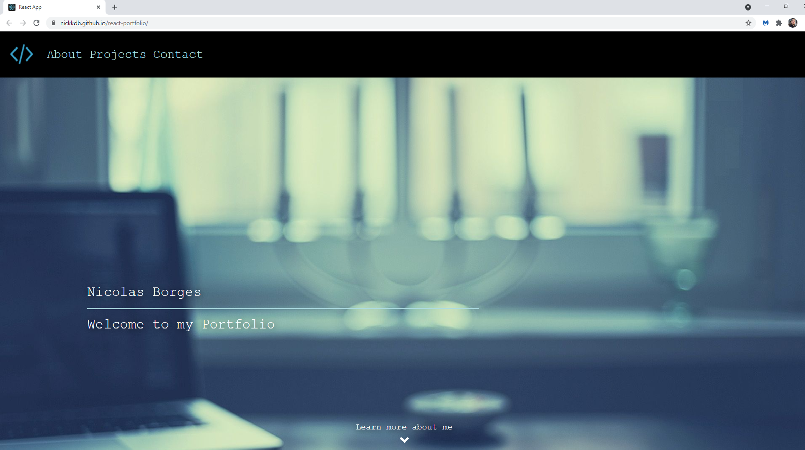

 # My Portfolio

https://nickkdb.github.io/react-portfolio/
    
## Table of Contents
- [Description](#Description)
- [Usage](#Usage)
- [Questions](#Questions)

## Description
> Welcome to my portfolio. This project dives into who I am and my goals as a developer. It also features a link to download a PDF of my resume, screenshots and links to my projects, and all my necessary contact information. This project was built using Javascript, React, Node, Bootstrap, and more.

## Usage
> To use this project, navigate to the link provided above and enjoy! Links to my various pages and projects are all included, and a contact form is provided at the bottom if you'd like to get in immediate contact with me. My email is also listed in the footer of the page.

## Questions
To reach me with additional questions:
>
> Find me on [GitHub](https://github.com/nickkdb)
>
> Send me an [Email](mailto:nborges.dev@gmail.com)